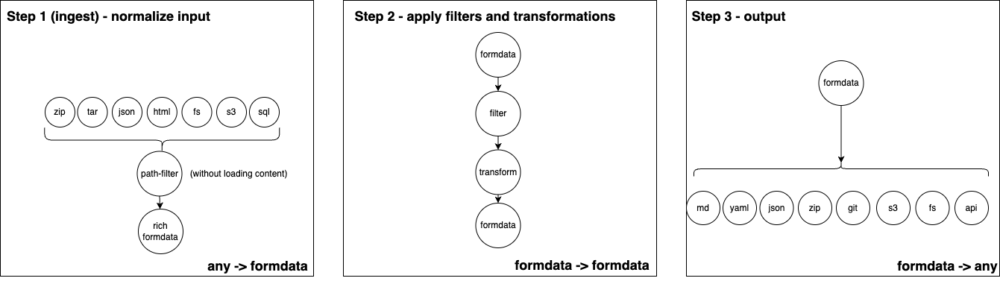

# Universal Information Terminal Hub

U.I.T. is a library for **performant, modular, low-memory** file processing at scale, in the Cloud. It works by offering a 4-step process to gather a file hierarchy from any desired modalty, apply filters and transformations, and output it in any desired modality.

- **performance**: speed is of essence when navigating and searching through large amounts of data
- **low-memory** by applying streaming and parallelization we can run this in low-memory environments such as Cloudflare workers
- **modular**: modularity is beneficial because by making it composable we get a clear high-level overview of all building blocks. also, not all building blocks can be ran in the same runtime or location.

U.I.T. has come about after many iterations of the platform of [uithub](https://uithub.com), which started as a simple node-based parser of zipfiles. While building more and more features and add-ons, I found myself limited by the memory a lot as I was not streaming enough, and going back to JSON too early (because using the Streams API is tricky!). Thus, as features and complexity grew the need was born to create a more modular extensible architecture with good serverless practices in mind.

`FormData` has a long history [[RFC 1867 (1995)](https://datatracker.ietf.org/doc/html/rfc1867)] [[RFC 2388 (1998)](https://datatracker.ietf.org/doc/html/rfc2388)] [[RFC 7578 (2015)](https://datatracker.ietf.org/doc/html/rfc7578)] and is deeply embedded into the web. It offers an excellent way to serve multiple files, binary and textual, over a single request. Although `FormData` does not support intermediate reading directly from `Request` and other Web Standards yet, UIT leverages the fact that intermediate results can be read using the [Streams API](https://developer.mozilla.org/en-US/docs/Web/API/Streams_API) using [multipart-formdata-stream-js](https://github.com/janwilmake/multipart-formdata-stream-js).

UIT cleverly modularizes filters and transformations on file hierarchies by providing an elegant way to combine multiple UIT 'modules' together to get to a final result. Every UIT 'module' can apply path filters, content filters, and content transformations, to change the files in the file hierarchy, all while streaming, and even merge multiple file hierarchies together in the blink of an eye.

## UIT Modules

UIT provides the following modules that can be combined to create powerful file processing pipelines:

- [**uithub.ingestzip**](./uithub.ingestzip) - Ingests and processes ZIP files into normalized formdata format
- [**uithub.merge**](./uithub.merge) - Combines multiple formdata streams into a single unified stream
- [**uithub.outputmd**](./uithub.outputmd) - Transforms and outputs data as markdown files
- [**uithub.outputzip**](./uithub.outputzip) - Packages processed data into downloadable ZIP archives
- [**uithub.pipe**](./uithub.pipe) - Handles data transformation workflows between different formats
- [**uithub.search**](./uithub.search) - Provides search capabilities across file hierarchies
- [**uithub.ziptree**](./uithub.ziptree) - Highly performant zip file-hierarchy extractor

Each module is designed to perform a specific step in the UIT 4-step process (ingest, filter/transform, merge, output) while maintaining performance and low memory usage.

It is important to note that each of these modules can be independently hosted as a cloudflare worker, but the spec doesn't require it to be hosted on Cloudflare per se, you can also host UIT modules in other runtimes, as long as it's compliant with the [UIT Protocol](#uit-protocol)

Please also note that above diagrams showcase many modules that haven't don't exist yet, but could be beneficial to exist.

## UIT Protocol

The UIT Protocol is the convention that characterizes any UIT module. As can be seen in the diagrams above, any UIT module must be one of these 4 module types:

- **ingest module** - streams any datastructure into a FormData stream
- **merge module** - streams several FormData sources into a single FormData stream
- **filter/transform module** - applies filters and transformations on files in a streaming fashion while in the FormData 'modality'.
- **output module** - streams a FormData stream into any desired datastructure

The only formalized convention/protocol you need to understand to create a UIT module, is which FormData headers UIT modules work with. These FormData headers can be divided into standard and non-standard (custom) headers:

### Standard FormData Headers

1. **Content-Disposition**: The main required header that contains:

   - `name` - Should be equal to filename (required)
   - `filename` - Original pathname to the file (optional in FormData, required for UIT)

2. **Content-Type**: Specifies the MIME type of the data

3. **Content-Length**: Indicates the uncompressed size of the data

4. **Content-Transfer-Encoding**: Specifies how the data is encoded. [FormData specifies these possibilities](https://www.w3.org/Protocols/rfc1341/5_Content-Transfer-Encoding.html):
   - `binary` - required for binary files
   - `8bit` - recommended for text-based (utf8) files
   - `quoted-printable`
   - `base64`
   - `7bit` (default)

### Non-Standard (Custom) Headers

The parser supports custom "x-" prefixed headers:

1. **x-url**: A non-standard header to specify the URL that locates the binary file.

2. **x-file-hash**: A non-standard header to store the hash of the file

[The multipart parser](https://github.com/janwilmake/multipart-formdata-stream-js) is designed to handle all these header and can be a useful libary to create FormData filter/transformers. It extracts them from the raw header lines and makes them available in the Part object. The library also maintains the original `headerLines` as part of the parsed data structure.

## Contributing to UIT

UIT aims to be a convention to streaming, filtering, and transforming binary and textual file hierarchies in the Cloud, and maintains a curated list of first-party and third-party libraries that can be included into any UIT data-transformation flow.

- https://github.com/janwilmake/uithub.swc - Parses Typescript Code into its components
- https://github.com/janwilmake/uithub.typedoc - Parses Typescript Code into markdown spec docs

Please open a discussion, issue, pull request, or [reach out](https://x.com/janwilmake) if you want a new module to be added to this list or have any unmet requirements. UIT is also looking for sponsors.

# Links

- [TODO.md](TODO.md)
- [BACKLOG.md](BACKLOG.md)
- [CHANGELOG.md](CHANGELOG.md)
- [ADR.md](ADR.md)

~ Being made with ❤️ by [janwilmake](https://x.com/janwilmake)
