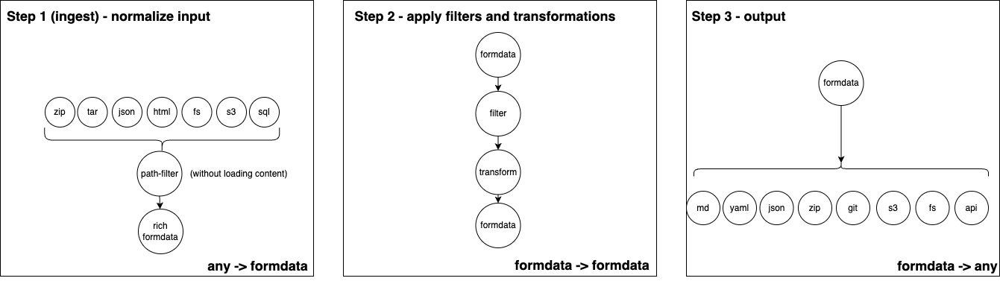

# TODO

1. ✅ make it usable and gather early feedback (silently open source it) (TARGET: april 8, 2025)
2. ✅ Rename all of zipobject to uithub. uithub means 'universal information terminal hub'
3. ✅ Let's show some ppl/ais and figure out what to do next! (did this until april 20, 2025)
4. ✅ Deploy to uuithub.com
5. As usable as v1
6. Create blogpost / announcement thread, DM influencers
7. Plugins that I already have, accessible for free.
8. FAQ
9. Genignore
10. Launch (Friday, april 25th, 6PM)

**After launch**

11. Implement `uithub.otp` and use it in `uithub.ingestzip`
12. Implement `monetaryurl` and use it everywhere
13. Implement useful plugins!!!
14. Add ability to configure a `dev` plugin with cookie for remote development with uithub as DX interface for testing.

# 2025-04-25 (FEEDBACK)

- ✅ Improved plugins tab
- ✅ Improved overal layout
- ✅ Improved search tab
- ✅ 'No results' warning: 'No results. Please check your filters'
- ✅ Tab should be localStorage reminded, not populated from URL
- ✅ Add download button
- ✅ Made quick draft for outputjson
- ✅ Removed YAML Button for now
- ✅ Test `isRegex`
- ✅ Added 'copy as curl' button
- ✅ Test login 401 flow after hitting ratelimit. 
- ✅ Identified private repo problem. Fix tree error!!!
- ✅ Fixed branch bug when logged in
- ✅ Private repo not working; https://uuithub.com/janwilmake/forgithub.activity. Add repo scope!

## Critical before launch

- ❗️ Tested paymentflow. ❌ Sponsorflare Sponsoring isn't working for new sponsors. Fix this by looking at changes too (or let's move to Stripe?)
- ❗️ PERFORMANCE (Try filter on path and extension(binary) early). If a file can be filtered out without loading the file itself, that must be done! I want things to be FAST. it should especially be fast skipping over files we don't need such as binary and files and files for which the path/size doesn't match.
- ❗️ `outputmd` needs the whole file-tree in the md result with info on tokensize and what was omitted.
- ❗️ Plugins: at least the API ones from URL should work!

# UI Enhancements 

- In `uithub.search` expose whether or not tokens were capped with `maxTokens` or not. Then, In uithub UI (`vscode.html`), add filter warning if tokens were capped that says "apply filters for better results".
- `search.js`: basepath should show up on search to easily remove (maybe should first ensure for a basePath in `window.data`)
- `explore.js`: gray out based by comparing final paths with filetree via `string[].includes`. For this we need the final tree as structured data as well.

# BLOGPOST (start 3PM++)

Focus the blogpost on the modular nature of file processing.

# Genignore UI old github

It'd be a great way to get a better default filter. It's hard though as we want not to cache too fast.

- ❗️ Fix genignore in old uithub so I can make PRs for it. 🔥 Important for adoption. Huge boost to SEO.
- ❗️ `?genignore` can be empty to disable, a URL to get from there, or a genignore content string to overwrite
- Use https://uithub.com/OAI/OpenAPI-Specification?genignore=https://genignore.forgithub.com/custom/oai__openapi-specification/.genignore and confirm that works.
- Put a badge onthere with a nice message.
- Add UI to edit .genignore parameter in old version.
- In this modal you should be able click through to add the `.genignore` to the repo. There should be a comment inthere refering to uithub
- ❗️ Fix 'add to readme' button default branch (should be added into context!)

# `FAQ.json`

- ✅ Make a schema for it; answers would be instantly answerable by LLM
- ✅ Create default faq and FAQ.json for `uit` which, currently, just inherits from the default.
- Uithub should always look for `FAQ.json` and `.genignore` and if they exist, push to the HTML
- In uithub interface, FAQs should be easily accessible if the file is present (probably in search tab)
