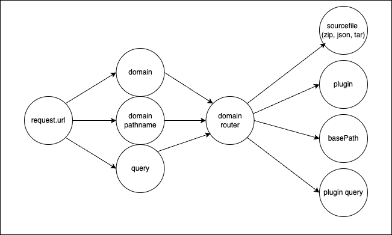
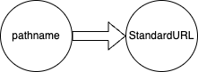

# UIT routing convention (RFC draft)

The goal for uithub is to support the entire url structure of major websites, and make its data accessible to APIs and LLMs at high scale. uithub brings the UIT protocol to the browser by routing any URL structure to the right source, plugin, and query params. This allows uithub to view context for any domain.

uithub's routing applies the following rules:

1. `github` is the default applied router
2. if the first segment is of format `{domain.tld}`, another router gets applied to retrieve the source
3. if there is no router for `{domain.tld}` the `domain crawling convention` is applied.

# Conventions in the URL Structure

A regular uithub URL pathname consists of these parts, all are optional:

- `domain`
- `pluginId`
- extension (determines desired output format)
- source locator (can consist of `primarySourceSegment` and `secondarySourceSegment`)
- `basePath`

This allow accessing any source and explore/transform it in different ways.

| Feature                | URL Pattern                                                    | Description                                                | Routing Complete | Implementation Done | Stable |
| ---------------------- | -------------------------------------------------------------- | ---------------------------------------------------------- | ---------------- | ------------------- | ------ |
| Domain specific router | uithub.com/**{domain.tld}**                                    | Use domain as owner with repository being an ID            | ✅               | ✅                  | ✅     |
| Alternative Page Types | uithub.com/{owner}/{repository}/**{pluginId}**/{branch}/{path} | Page type can be any compatible plugin                     | ✅               | ✅                  | ❌     |
| Extended Format        | uithub.com/{owner}/{repository}/**{pluginId}.{ext}**           | Add file extension to page type for different data formats | ✅               | ✅                  | ❌     |

The following is an example for GitHub, which is also the standard router used when no domain is specified:

# Domain crawling convention

The uit routing system applies the following rules when a domain does not have its own specified router API. This convention is experimental and will have breaking changes. Feedback much appreciated, let's come up with the best convention together!

1. look for `/archive.zip` at the domain root. If found, this is used as source. We can also conventionalise "backracking" support, which would search for archive.zip for any path and go back he pathname until found.
2. use the `reader.llmtext.com/{domain.tld}/{basePath}` router if not found, which will crawl the website (WIP)

# Creating a router

Anyone can create a website-router to become viewable by uithub. For any given domain, uithub will adopt community-contributed routers of popular websites until the website owner provides their own official router.

Your domain specific router should mirror the `GET` URL structure of the original domain, map the `pathname` to a StandardURL JSON Response. See [standard-url.d.ts](./standard-url.d.ts) for the most up-to-date specification.

# Implemented routers (so far)

See [COVERAGE.md](COVERAGE.md)
