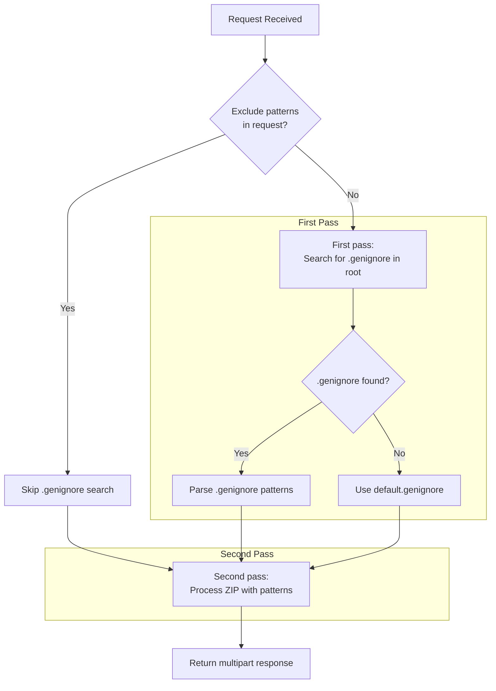

# genignore

https://claude.ai/share/6e7287e2-72ce-496d-b4f7-88d12d8ea0ed

Prompt: I want to extend this with the firstPass idea.

1. if `excludePathPatterns` wasn't provided (also not an empty string), it should do the first pass. otherwise, excludePathPatterns provided in query are enough.
2. the first pass should only look in the root directory, stop when it finds .genignore, or stop if it finds a non-dot file (meaning we passed all dot files)
3. all comments and blank lines for genignore are removed, now we end up with the excludePathPatterns[] to use.
4. if `.genignore` wasn't found, should use `default.genignore` imported using `import defaultGenignore from "./default.genignore";. the file is there.

Please create the utility functions I need so I can embed it in this code.

# Glob filtering

I'm using https://github.com/isaacs/minimatch/tree/main/src

Claude suggests to search for a faster alternative:

https://claude.ai/share/b54c0d45-8ed0-4bab-98f3-03ec4339dcf3

These came up:

https://github.com/devongovett/glob-match
https://github.com/micromatch/micromatch
https://github.com/terkelg/tiny-glob
https://github.com/mrmlnc/fast-glob
https://github.com/rbranson/glob-trie.js/
https://github.com/sindresorhus/globby
https://github.com/micromatch/picomatch

Claude recommends picomatch

I gave claude picomatch context: https://uuithub.com/micromatch/picomatch?excludePathPatterns=*.json&excludePathPatterns=.gitattributes&excludePathPatterns=.editorconfig&excludePathPatterns=bench&excludePathPatterns=examples&excludePathPatterns=test&excludePathPatterns=.github&excludePathPatterns=.gitignore&excludePathPatterns=.npmrc&excludePathPatterns=.verb.md&excludePathPatterns=LICENSE&excludePathPatterns=package.json

Looking at the picomatch code, I think it's an excellent choice for your gitignore-style pattern matching needs, especially in a Cloudflare environment where performance matters for processing large numbers of files. Here's my analysis:

## Why Picomatch Is a Great Fit

1. **Lightweight and Browser-Compatible**:

   - The recent changes (v4.0.0) removed Node.js-specific dependencies to make it work in browser environments
   - No external dependencies
   - Compatible with Cloudflare Workers

2. **Performance-Focused**:

   - Implements fast paths for common glob patterns
   - Optimized tokenization and parsing
   - Uses smart caching of compiled patterns

3. **Support for Gitignore Patterns**:

   - Handles negation patterns with `!` prefix
   - Supports nested directories with `**`
   - Handles path-specific patterns
   - Properly manages `.` files/folders (dotfiles)

4. **VSCode-Style Matching**:

   - Supports all the patterns needed for VSCode-style filtering
   - Handles extglobs, brackets, and other advanced matching features
   - Accurate implementation of glob behavior

5. **Compatible with Your Requirements**:
   - Can efficiently scan many files (100k+) against multiple patterns
   - API is designed for reusing compiled patterns

# Efficiency of my zip stream implementation

https://claude.ai/share/9b094feb-bcb7-4f79-af7e-29eda292ee8b
