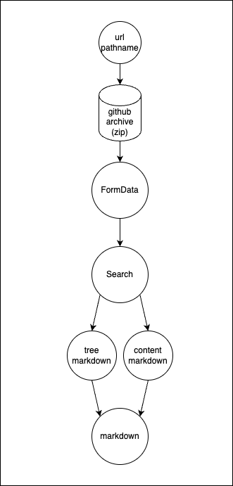

This repo pipes all building blocks together to perform a single request that is chained all the way down to github and back. It has these components:

Besides this, there's some experimenting inhere because the problem with this approach is that all parameters need to be passed through the entire chain, including authentication of the github repo, which is not ideal in settings where one of the components may be hosted by another author.

A goal for UIT will ultimately be to have an OpenAPI-based SDK that allows type safety between the steps in the chain.
