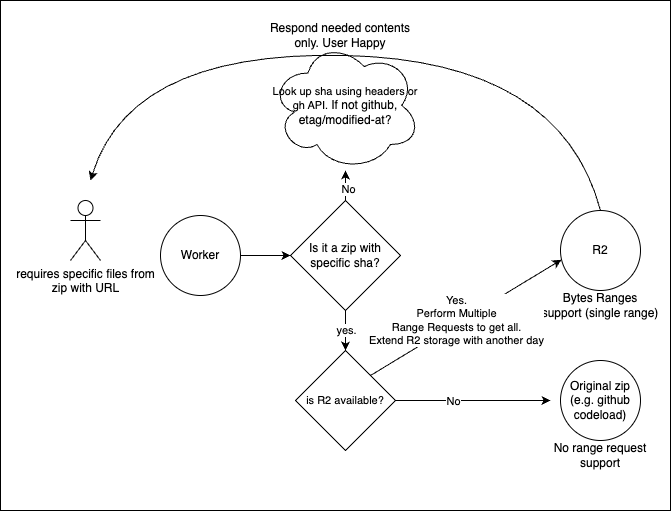

Tried https://gildas-lormeau.github.io/zip.js/ within a cloudflare worker, streaming. It seems to work except for that for large files, e.g. http://localhost:3000/?url=https://github.com/facebook/react/archive/refs/heads/main.zip it will never respond and keep hanging at the end, even though it successfully saves the resulting metadadata in the r2.

# ZIP range reader

If this is all true (https://claude.ai/chat/8529077d-ba1e-478d-94c9-12c93f9ff68d), and if it's already implemented in this efficient manner, we can much more efficiently get the files we need by using a max depth after just reading the central directory using the HttpRangeReader. This should allow much more control and speed.

Try this implementation, taking https://github.com/janwilmake/cloudflare-zip and adapting it to the following:

```ts
async function readZipSubset(url, targetPrefix) {
  // Use HttpRangeReader for efficient HTTP fetching
  const reader = new HttpRangeReader(url, {
    useRangeHeader: true,
    combineSizeEocd: true,
  });

  const zipReader = new ZipReader(reader);
  const targetEntries = [];

  try {
    // Use generator to process entries one at a time
    for await (const entry of zipReader.getEntriesGenerator()) {
      if (entry.filename.startsWith(targetPrefix)) {
        targetEntries.push(entry);
      }
    }

    // Process only the entries we want
    return await Promise.all(
      targetEntries.map(async (entry) => {
        return {
          name: entry.filename,
          data: await entry.getData(new BlobWriter()),
        };
      }),
    );
  } finally {
    // Clean up
    await zipReader.close();
  }
}

// Usage example:
const results = await readZipSubset(
  "http://example.com/large.zip",
  "src/lib/abc/",
);
```

If that works fast (try for bun.sh for example and then getting a very deeply nested file) we can use this as a base, and add in a max-depth and basePath filter, as well as other filters based on information we have. How about reading/returning just the entries in the first place?

If zip.js is too limited, try https://github.com/ozkatz/cloudzip or other similar libs

If github zips doesn't support range requests, it's a MF bummer. But that could be solved by opening an issue or potentially caching the top x% popular zips to a max of €10 per month.

If I can figure this out, uithub will also be able to become much faster!

# Trying it

After trying this, I found that, unfortunately, it seems both GitHub and GitLab don't reply with any `Accept-Ranges:bytes` header. According to https://developer.mozilla.org/en-US/docs/Web/HTTP/Headers/Accept-Ranges this means they both don't support it.

Looking at blob storage, it seems R2 supports range requests but not multipart.

https://community.cloudflare.com/t/multipart-http-range-requests-on-r2-not-working/665609
https://stackoverflow.com/questions/19162723/amazon-s3-multiple-byte-range-request

The same goes for S3. This means we cannot do multiple ranges, however, we can still do a single range request that contains multiple files. We should then be able to further unpack the returned blob using the original offset data. This would likely greatly reduce the amount of requests.

# TODO

1. Do a test with a zip in a R2 to see if I can get a single file from there using the range and zip.js
2. Do a test where I quickly get the systemdirectory
3. Do a test to prove I can get multiple subsequent files, and then unpack that in my worker, using a multipart stream (or so)

If all of the above work, let's create a setup like this:



Extending the R2 storage of a blob each time it is requested would allow to optimise storage not spending too much on rare zips.

<!-- Implementing this basically makes for a much faster version of uithub as only retrieval of the needed files would be needed. A specific subfolder of a 1GB zip would take seconds as just a few % needs to go over the thread. And it would set a great foundation for further tools. -->

# ADR 2025-03-15

Learning 1: not all root files are at the start. Only dot files and certain special files such as readme come before all other things.

Learning 2: There are many tricks but the most important is we can look at content-length to quickly move to the end of the file, and look at progressively bigger chunks from there to find the start of the central directory.

# ADR 2025-03-17

- github doesn't support range request for zipfiles
- github redirects ziplocation to codeload.something domain
- github codeload sometimes returns content-length but not always, possibly because the zip isn't always generated yet.
