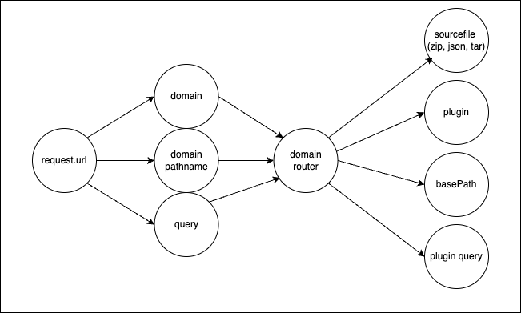

# uithub router

uithub brings the UIT protocol to the browser by routing any URL structure to the right source, plugin, and query params. This allows uithub to view context for any domain.

Anyone can create a website-router to become viewable by uithub. Your domain specific router should mirror the URL structure of the original domain (e.g. github -> uithub, x -> xymake) and map the URL to a StandardURL JSON Response. See [standard-url.schema.json](public/standard-url.schema.json) for the specification.

# notes

github.com/owner/repo/page/branch/...subpath

npmjs.com/package/@owner/package

x.com/i/lists/23479878723

||

uithub.com/url-id/{page}[/url-id-part2]/subpath?query...

How should the convention work?

1. github is the default source
2. if first segment is of format {domain.tld}, another router gets applied to retrieve the source
3. which is the basePath and branch (optional) is determined based on the pathname and the domain. {subPath} is then known

Uithub URL pathname consists of:

- source-locator
- page
- version-identifier (optional)
- subpath

This should allow accessing any source and explore/transform it in different ways.

TODO - create this URL parser

# Idea:

If i want any website to be accessible from uithub.com, it should have an archive.zip file somewhere at a conventional location.

How it could work:

- With URL Structure: uithub.com/owner/repo/tree/branch/...path
- Example: xymake.com/janwilmake/archive-main.zip
- Becomes: uithub.com/xymake.com/janwilmake/tree/main/...path

This way, any website can be served via the uithub interface!

---

Rather than changing the page, since this outputs a fully new file-tree, this could be seen as an unapplied shadow-branch called `shadow/swc` and can be made available at https://uithub.com/owner/repo/tree/shadow/swc/...path

Question: which URL structure is better?

- https://uithub.com/owner/repo/tree/shadow/swc/...path
- https://uithub.com/owner/repo/swc/main/...path

I think the answer is the latter, as its shorter and works for any branch. It can then be pushed to a real branch if desired, creating a shadowbranch for any branch, calling the shadowbranch `shadow/swc/{branch}`.

#

How to allow for /owner/repo while also allowing for /dotcomhostname/id? should i want this? maybe only for certain well-known dot coms that dont have a github username?

what works well together:

/owner/repo -> github.com

/hostname.tld/id -> hostname.tld

https://github.com/x is an active account so I wouldn't want to deny that.

ultimately, I'd want:

uit/[hostname]/[id]/[page]/[branch]/[basePath]

e.g. uit/x/dhh

but also: https://www.uit.com/oapis.org/public/tree/main

If i have uit.com, this can become easier, as https://uithub.com can redirect to uit.com/github/... and we don't need to have the owner/repo thing.

url convention idea: https://x.com/janwilmake/status/1908066262514848040

# backtracking

The simple convention could be the following, like i also planned for zipobject:

- uit/x/dhh/lists --> https://xymake.com/dhh/lists/archive.zip or https://xymake.com/dhh/archive.zip#lists

What's useful about this is that xymake can choose to cache things at a more nested level for optimal efficiency.

# openapisearch.com

Here we wanna find a url structure as well that works nicely for domains as well as for github repos. the simplest way is probably:

- decode url
- remove protocol `https?://` (redirect)
- remove `.com` (redirect)
- remove suffix `/openapi.json` (redirect)
- keep a harcoded list of storage domains such as github, npm, etc, that allow alternative name:
  - openapisearch.com/https://github.com/janwilmake/openapisearch/tree/main/openapi.json -> openapisearch/janwilmake_openapisearch.githus
  - openapisearch/janwilmake_openapisearch.githus/handmade/brandwatch.json
